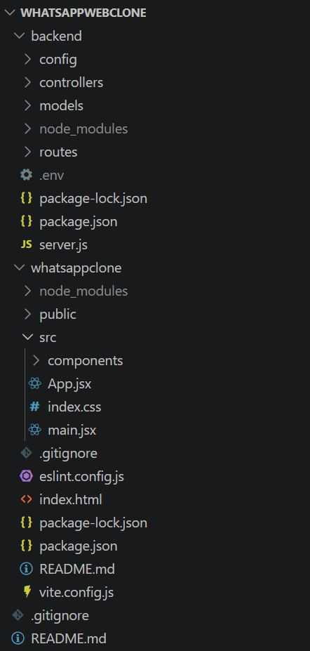
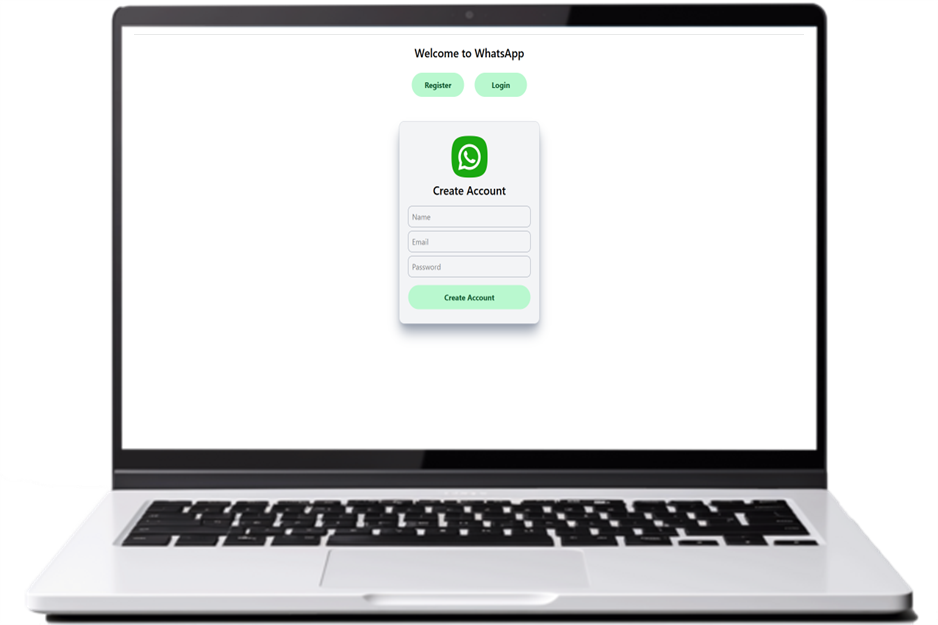
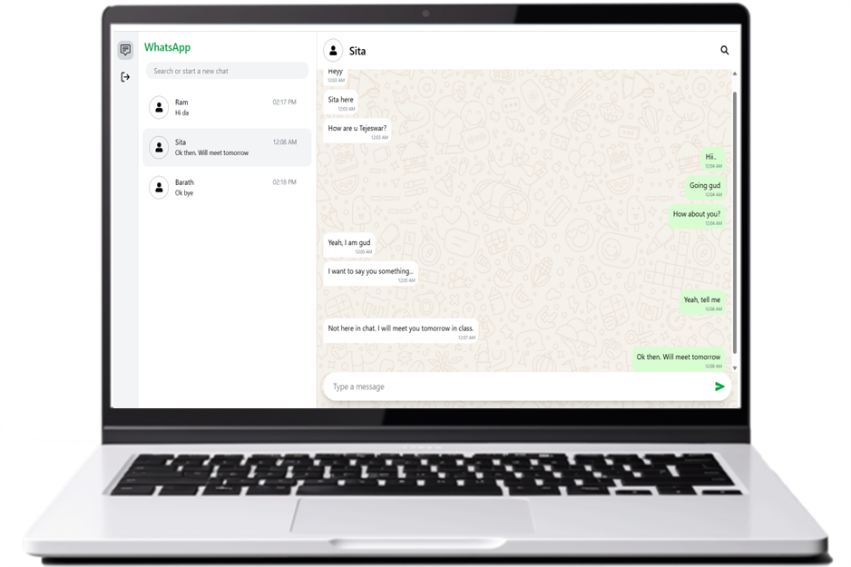

## WhatsApp Clone - Humbletree

A full-stack WhatsApp Web clone built using React, Node.js, Express, and MongoDB with real-time chat functionality.

## Features

- Real-time chat UI
- One-to-one messaging
- WhatsApp-like interface
- Chat sidebar with users
- Last message preview
- Auto scroll to latest message
- Timestamp display
- Search users


## Tech Stack

- React.js
- Node.js
- Express.js
- MongoDB
- Axios
- Tailwind CSS

## Setup Development

## Tech Setup

1. Fork the repo and clone the forked repo.
2. Install the latest LTS version of Node.js from https://nodejs.org/en in your machine.

## Backend Setup

3. Navigate to backend folder:

```bash
cd backend
```

4. Install dependencies:
```bash
npm install
```

5. Create a .env file in the backend root directory:
```
PORT=3001
MONGO_URI=your_mongodb_connection_string
```

6. Start backend server:

```bash
node server.js
```
You should see
```bash
Server running on PORT 3001
DB Connected
```

## Frontend Setup

7. Open new terminal and navigate to whatsappclone folder (which is the frontend folder).
   NOTE: Do not close the backend terminal
```bash
cd whatsappclone
```

8. Install dependencies for frontend
```bash
npm install
```

9. Start the React development server
```bash
npm run dev
```
The app will open at http://localhost:5173/.

## Folder Structure


## Authentication Page


## Chat Interface
